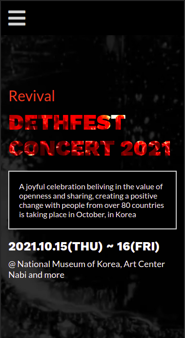
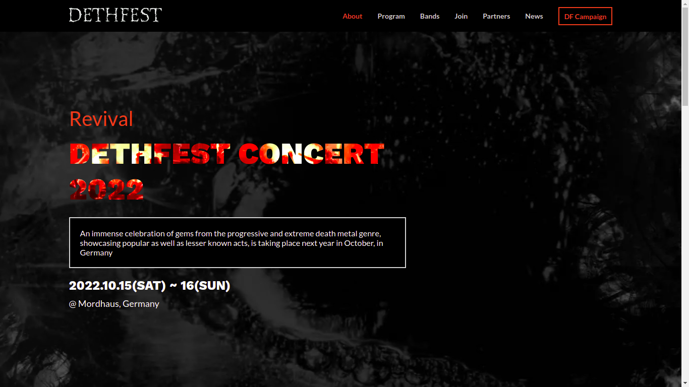

# Dethfest

> Website for Dethfest concert





This project is a website built as my HTML/CSS + JS capstone project at Microverse. It showcases a fictitious Metal concert called Dethfest.

It is built with HTML5, Sass, JS, and Jekyll.

# Project Highlights: [view video presentation](https://www.loom.com/share/e495c1f4cad846d8b3512d27eb620c33)

### - Modularises HTML into [partials](https://github.com/AkashaRojee/dethfest/tree/main/_includes) using Jekyll, and uses a base HTML layout to build the final page

https://github.com/AkashaRojee/dethfest/blob/a0e4ccef42faa275b555d812a46d3f396d96b0a3/_layouts/default.html#L1-L32

### - Reusable SCSS via libraries I custom-built over multiple projects

#### Custom functionalities

https://github.com/AkashaRojee/dethfest/blob/a0e4ccef42faa275b555d812a46d3f396d96b0a3/css/imports/_custom.scss#L5-L31

https://github.com/AkashaRojee/dethfest/blob/a0e4ccef42faa275b555d812a46d3f396d96b0a3/css/imports/_custom.scss#L52-L67

#### Custom responsive Flex CSS library

https://github.com/AkashaRojee/dethfest/blob/a0e4ccef42faa275b555d812a46d3f396d96b0a3/css/imports/_flex.scss#L7-L57

### - Experimented with Sass mixins to create reusable responsive styles

https://github.com/AkashaRojee/dethfest/blob/a0e4ccef42faa275b555d812a46d3f396d96b0a3/css/style.scss#L14-L73

https://github.com/AkashaRojee/dethfest/blob/a0e4ccef42faa275b555d812a46d3f396d96b0a3/css/style.scss#L293-L319

- JS is modularised with custom-built functions
- Sections with repeating elements are populated dynamically using JS
- The mobile version includes a mobile menu operated using JS
- The website is responsive and includes mobile (up to 768 px) and desktop view

## Built With

- Major languages: HTML, CSS, JS
- Others: SCSS, YAML, Liquid
- Frameworks: Jekyll
- Technologies used: Lighthouse, Webhint, Stylelint, ESLint

## Live Demo

[Live Demo Link](https://AkashaRojee.github.io/dethfest)

## Getting Started

To get a local copy up and running follow these simple example steps.

### Prerequisites

Jekyll - _<a href="https://jekyllrb.com/docs/installation" target="_blank">view the Jekyll docs for the installation guide_

### Usage

The HTML used throughout the website is broken down into partials stored in the `_includes` folder.

The base HTML layout for pages on the website is stored in the `_layouts` folder.

_For more information, <a href="https://jekyllrb.com/docs/structure" target="_blank">view the Jekyll docs about the directory structure</a>_.

### Deployment

To build the website, run the following command in the root of the repo:

```
bundle exec jekyll serve
```

This creates a `_site` folder where the generated site will be placed.

To view the website, open the link of the server address displayed in the terminal

Alternatively, to view the website automatically after building, run the the following command:

```
bundle exec jekyll serve --open-url
```

#### Note

`_site` is currently not included in .gitignore to allow linters in GitHub Actions workflows to run on the Jekyll-generated website instead of the partials.

## Author

👤 **Akasha Rojee**

- GitHub: [@AkashaRojee](https://github.com/AkashaRojee)
- Twitter: [@AkashaRojee](https://twitter.com/AkashaRojee)
- LinkedIn: [Akasha Rojee](https://linkedin.com/in/AkashaRojee)

## 🤝 Contributing

Contributions, issues, and feature requests are welcome!

Feel free to check the [issues page](../../issues/).

## Show your support

Give a ⭐️ if you like this project!
  
## Acknowledgements
  
- [Cindy Shin](https://www.behance.net/adagio07)

## 📝 License

This project is [MIT](./MIT.md) licensed.
