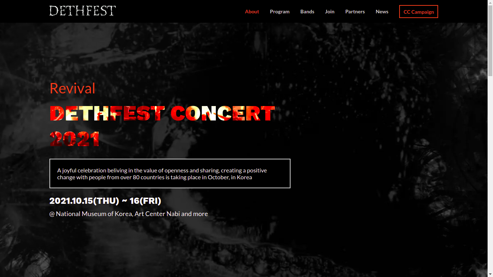

# Dethfest

> Website for Dethfest concert




This project is a website built for the HTML/CSS + JS capstone project at Microverse.

The project is based on an online website for a conference. The original design idea is by Cindy Shin - _<a href="https://www.behance.net/adagio07" target="_blank">view the website template on Behance</a>_.

I have personalised the template to build a website for a fictious Metal concert called Dethfest.

**Main things done:**

- Pages built: Home and About
- HTML is broken down into partials using Jekyll
- CSS is reusable through custom-built libraries
- JS is modularised with custom-built functions
- Flexbox is used for positioning
- The website is responsive and includes mobile (up to 768 px) and desktop view
- The mobile version includes a mobile menu operated using JS
- Sections with repeating elements are populated dynamically using JS

## Built With

- Major languages: HTML, CSS, JS
- Others: SCSS, YAML, Liquid
- Frameworks: Jekyll
- Technologies used: Lighthouse, Webhint, Stylelint, ESLint

## Live Demo

_<a href="https://AkashaRojee.github.io/dethfest">View Dethfest website</a>_

## Getting Started

To get a local copy up and running follow these simple example steps.

### Prerequisites

Jekyll - _<a href="https://jekyllrb.com/docs/installation" target="_blank">view the Jekyll docs for the installation guide_</a>

### Usage

The HTML used throughout the website is broken down into partials stored in the `_includes` folder.

The base HTML layout for pages on the website is stored in the `_layouts` folder.

_For more information, <a href="https://jekyllrb.com/docs/structure" target="_blank">view the Jekyll docs about the directory structure</a>_.

### Deployment

To build the website, run the following command in the root of the repo:

```
bundle exec jekyll serve
```

This creates a `_site` folder where the generated site will be placed.

To view the website, open the link of the server address displayed in the terminal

Alternatively, to view the website automatically after building, run the the following command:

```
bundle exec jekyll serve --open-url
```

#### Note

`_site` is currently not included in .gitignore to allow linters in GitHub Actions workflows to run on the Jekyll-generated website instead of the partials.

## Author

👤 **Akasha Rojee**

- GitHub: [@AkashaRojee](https://github.com/AkashaRojee)
- Twitter: [@AkashaRojee](https://twitter.com/AkashaRojee)
- LinkedIn: [Akasha Rojee](https://linkedin.com/in/AkashaRojee)

## 🤝 Contributing

Contributions, issues, and feature requests are welcome!

Feel free to check the [issues page](../../issues/).

## Show your support

Give a ⭐️ if you like this project!

## 📝 License

This project is [MIT](./MIT.md) licensed.